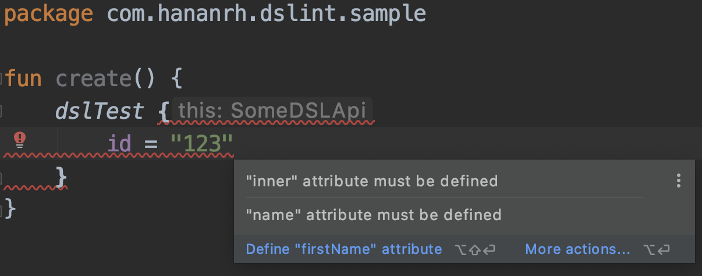
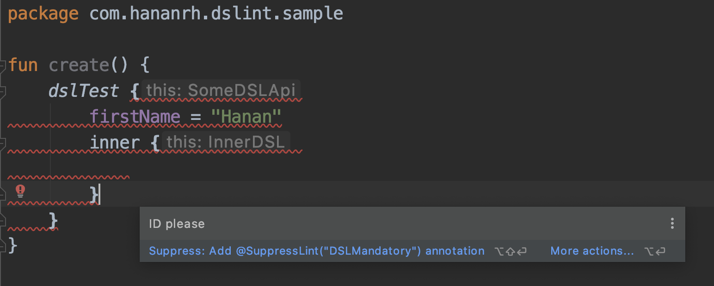
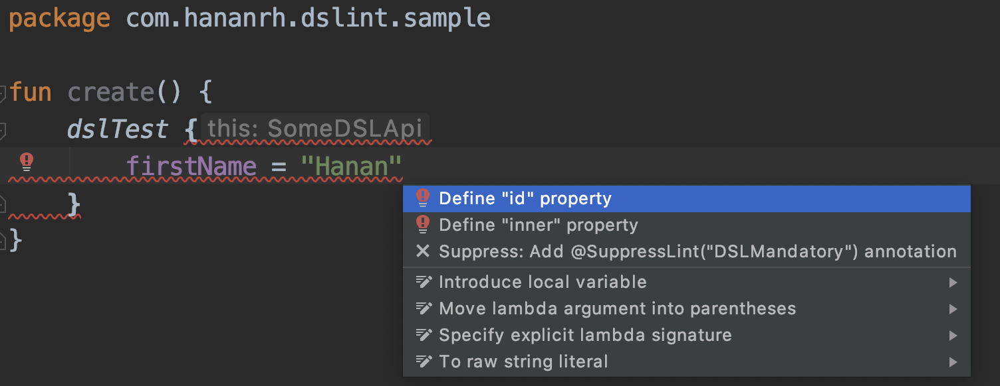

DSLint
============

A lightweight Android linter for Kotlin DSL aimed to solve the problem of verifying mandatory DSL attributes at compile time.
---
 
Usage
---
```kotlin
@DSLint
interface SomeDSLApi {

    @set:DSLMandatory(message = "ID please")
    var id: String

    @set:DSLMandatory(group = "name")
    var firstName: String

    @set:DSLMandatory(group = "name")
    var fullName: String

    var optional: String

    @DSLMandatory
    fun inner(block: SomeInnerDSLApi.() -> Unit)
}
```



Annotations
---
#### `@DSLint`
Use on a DSL class/interface that you want DSLint to verify.

#### `@DSLMandatory`
Use on mandatory DSL properties setters or functions.
Properties/functions annotated by this will generate a lint error if not
defined in the DSL lambda.

Grouping
---
Mandatory properties can be grouped together using the `group` attribute
in the `@DSLMandatory` annotation.
DSLint will verify that at least one of the properties in the group is defined.
```kotlin
@DSLint
interface SomeDSLApi {

    @set:DSLMandatory(group = "name")
    var firstName: String

    @set:DSLMandatory(group = "name")
    var fullName: String
}
```

Custom message
---
Custom error message can be defined using the `message` attribute in the `@DSLMandatory` annotation.
A custom message for grouped properties should be defined on the first property of the group.
```kotlin
@DSLint
interface SomeDSLApi {

    @set:DSLMandatory(message = "ID please")
    var id: String
}
```


Quickfix
---
DSLint offers quick fixes for adding missing mandatory properties. 


Requirements
--------
DSLint will always show errors inside Android Studio.
In order for DSLint to also work on the gradle lint task (for release builds) the following conditions must be met:
Gradle version >= 6.3
Android Gradle Plugin >= 4.0.1

Download
--------
#### For app developers
```groovy
dependencies {
    implementation 'com.ironsource.aura.dslint:dslint:1.0.2'
}
```

#### For SDK developers (DSLint linter will run on the app dependant on the SDK)
```groovy
dependencies {
    implementation 'com.ironsource.aura.dslint:dslint-annotations:1.0.2'
    lintPublish 'com.ironsource.aura.dslint:dslint-checks:1.0.2'
}
```

License
-------

Copyright (c) 2020 Hanan Rofe Haim

Permission is hereby granted, free of charge, to any person obtaining a copy
of this software and associated documentation files (the "Software"), to deal
in the Software without restriction, including without limitation the rights
to use, copy, modify, merge, publish, distribute, sublicense, and/or sell
copies of the Software, and to permit persons to whom the Software is
furnished to do so, subject to the following conditions:

The above copyright notice and this permission notice shall be included in all
copies or substantial portions of the Software.

THE SOFTWARE IS PROVIDED "AS IS", WITHOUT WARRANTY OF ANY KIND, EXPRESS OR
IMPLIED, INCLUDING BUT NOT LIMITED TO THE WARRANTIES OF MERCHANTABILITY,
FITNESS FOR A PARTICULAR PURPOSE AND NONINFRINGEMENT. IN NO EVENT SHALL THE
AUTHORS OR COPYRIGHT HOLDERS BE LIABLE FOR ANY CLAIM, DAMAGES OR OTHER
LIABILITY, WHETHER IN AN ACTION OF CONTRACT, TORT OR OTHERWISE, ARISING FROM,
OUT OF OR IN CONNECTION WITH THE SOFTWARE OR THE USE OR OTHER DEALINGS IN THE
SOFTWARE.
